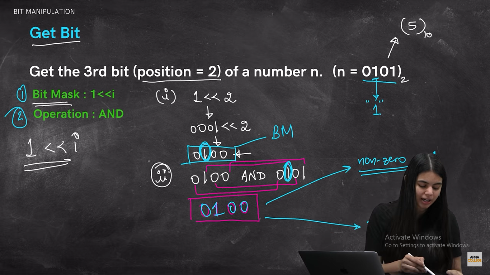
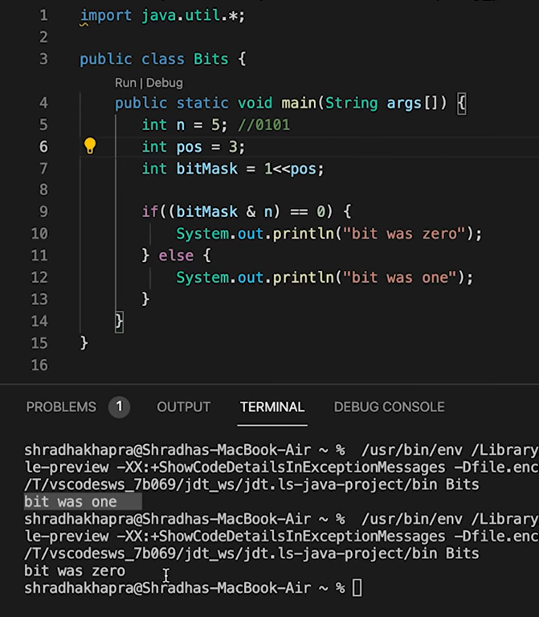
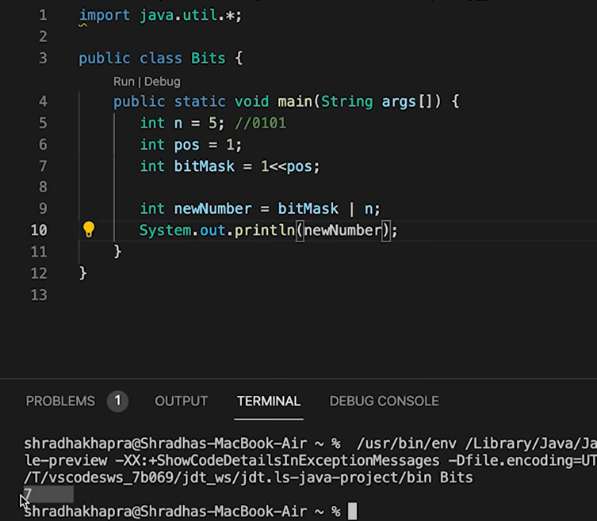
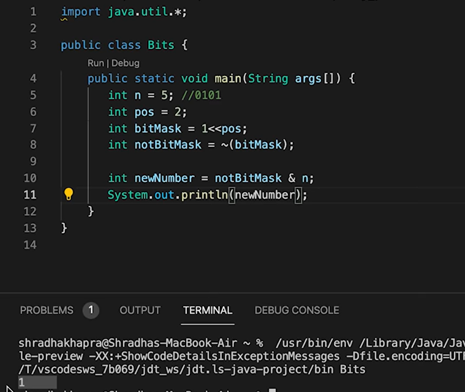
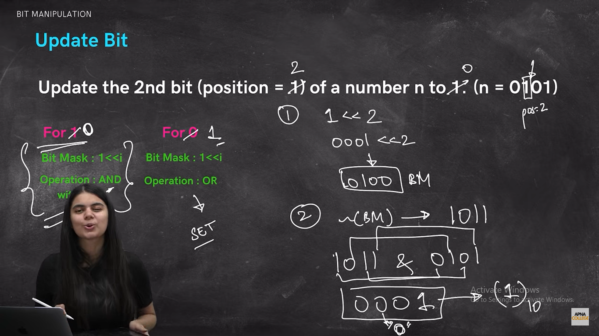
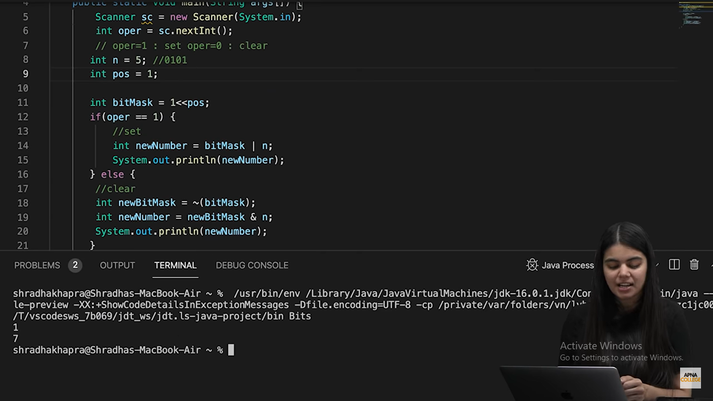
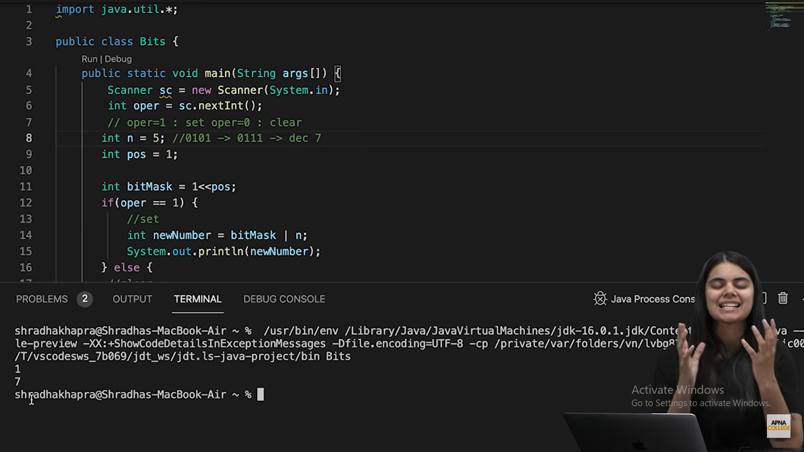

It is a very important topic.<br>
Here we will play with Binary Numbers.<br>

- **Left Shift** operator shifts the binary digits by `i` towards left. `N << i`
- **Right Shift** operator shifts the binary digits by `i` towards right. `N>> i`

# Operations in Bit Manipulation

**1. GET**

```
import java.util.*;

public class Bits {
   public static void main(String args[]) {
      int n = 5; //0101
      int pos = 3;
      int bitMask = 1<< pos;

      if((bitMask & n) == 0) {
          System.out.println("bit was zero");
      } else {
          System.out.println("bit was one");
      }
   }
}

```

<br>

**2. SET**

```
import java.util.*;

public class Bits {
   public static void main(String args[]) {
      int n = 5; //0101
      int pos = 1;
      int bitMask = 1<< pos;


      int newNumber = bitMask | n;
      System.out.println(newNumber);
   }
}
```

<br>

**3. CLEAR**

```
import java.util.*;
public class Bits {
  public static void main(String args[]) {
     int n = 5; //0101
     int pos = 2;
     int bitMask = 1<< pos;
     int newBitMask = ~(bitMask);
     int newNumber = newBitMask & n;
     System.out.println(newNumber);
  }
}
```

<br>

**4. UPDATE**

```
import java.util.*;

public class Bits {
   public static void main(String args[]) {
       Scanner sc = new Scanner(System.in);
       int oper = sc.nextInt();
       // oper=1 -> set; oper=0 -> clear
      int n = 5;
      int pos = 1;

      int bitMask = 1<<pos;
      if(oper == 1) {
          //set
          int newNumber = bitMask | n;
          System.out.println(newNumber);
      } else {
       //clear
       int newBitMask = ~(bitMask);
       int newNumber = newBitMask & n;
       System.out.println(newNumber);
      }
   }
}
```
# GET



# SET



# CLEAR



# UPDATE




